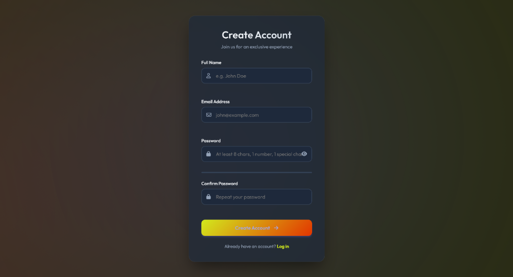
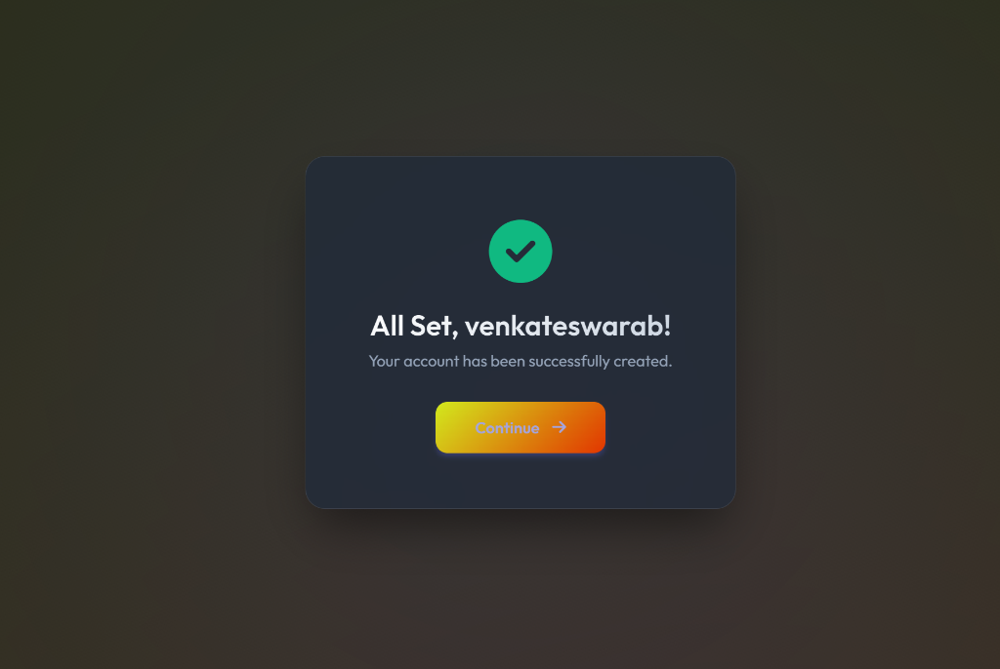

# Premium Registration Form (Task 9)

A high-fidelity, client-side validated registration form featuring glassmorphism design, real-time validation, and dynamic animations.

## Features
- **Premium UI:** Glassmorphism card effect with animated background.
- **Advanced Validation:** Real-time checking for username, email, password strength, and match.
- **Client-Side Interactions:** Instant feedback, password toggle, and smooth success state transitions.
- **Responsiveness:** Fully adaptive design for mobile and desktop.

## Screenshots

### Form Preview

### Success State

## Tech Stack
- HTML5
- CSS3 (Variables, Animations, Flexbox)
- JavaScript (ES6+, DOM Manipulation)
