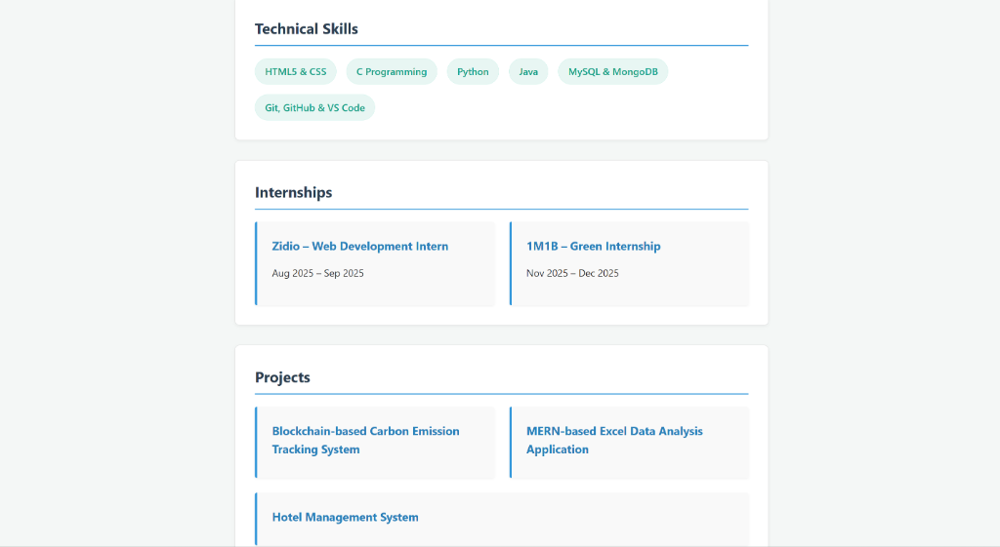
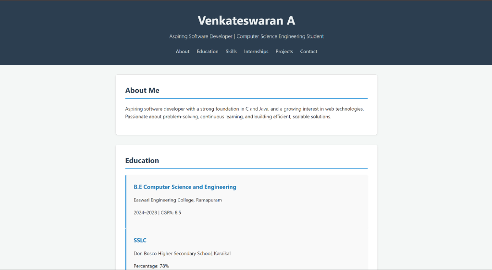

# Web Development Internship Task 3: Flexbox Layout

This project contains the solution for Task 3, which involves creating a responsive layout using CSS Flexbox.

## Features

- **Responsive Navigation**: The navigation bar adapts to screen size using `flex-wrap`.
- **Flexbox Card Layout**: Projects and Internships are displayed in a responsive grid-like layout using `flex` properties.
- **Skills Badges**: Technical skills are styled as pill-shaped badges using Flexbox.
- **Semantic HTML**: The structure remains semantic without divs replacing key elements.

## Screenshots

