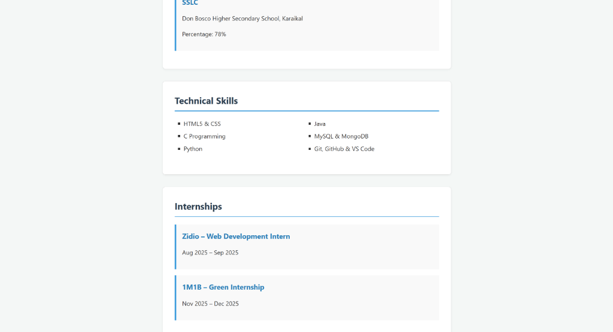
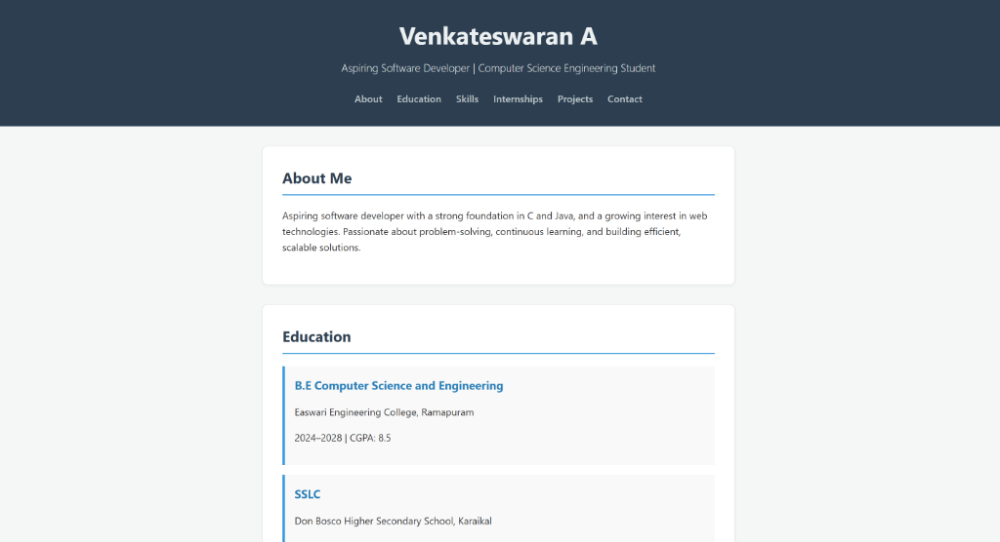

# Web Development Internship Task

This project contains the solution for the Web Development Internship task.

## Project Structure
- `index.html`: The main HTML document containing the semantic structure.
- `style.css`: The stylesheet demonstrating CSS box model and styling.

## Screenshots

