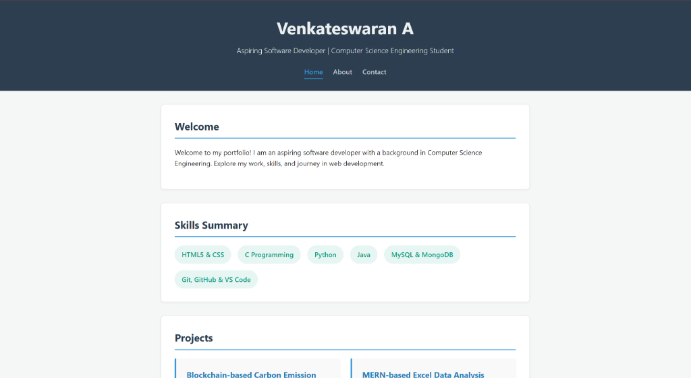
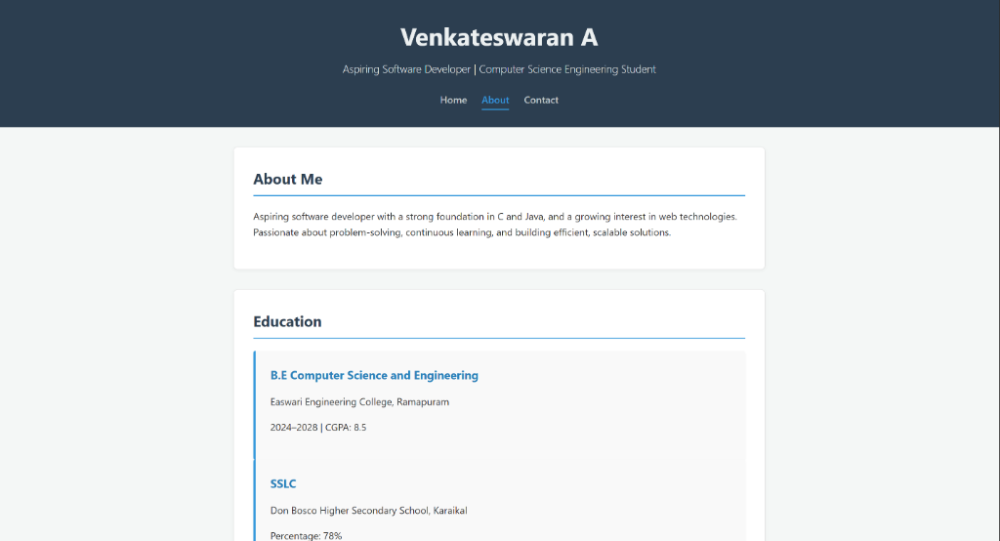

# Web Development Internship Task 4: Simple Multi-Page Website

This project contains the solution for Task 4, which involves creating a simple multi-page website with valid navigation.

## Features

- **Multi-Page Structure**: Created `index.html` (Home), `about.html`, and `contact.html`.
- **Navigation**: Consistent navigation bar across all pages with an `.active` class highlighting the current page.
- **Semantic HTML**: Continued use of semantic tags for structure.
- **Shared Styling**: Single `style.css` file managing the look and feel of all pages.

## Screenshots

### Home Page

### About Page

### Contact Page

