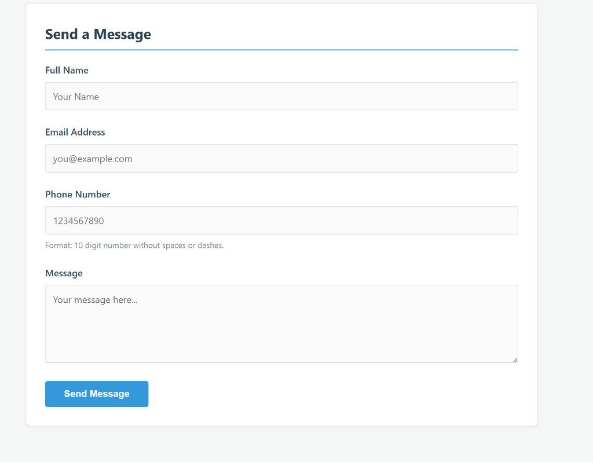
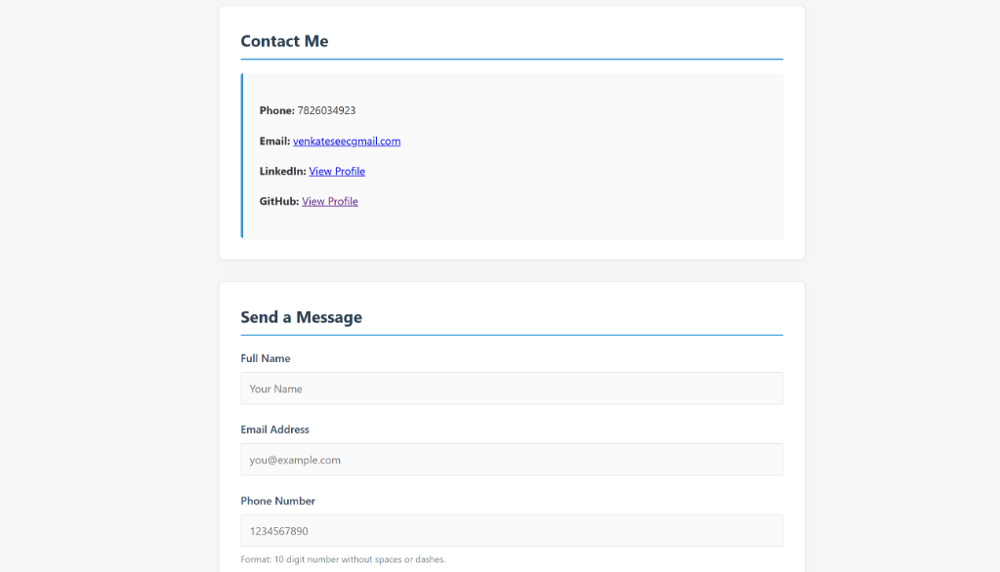

# Web Development Internship Project

This repository contains the completed tasks for the Web Development Internship, culminating in a hosted multi-page personal portfolio website.

## 🚀 Live Demo

**Deployed Website:** [https://venkateswaran07.github.io/Elevate-labs-/](https://venkateswaran07.github.io/Elevate-labs-/)

## Completed Tasks

- **Task 1**: Semantic HTML Profile Page
- **Task 2**: Styling with CSS Box Model
- **Task 3**: Responsive Flexbox Layout
- **Task 4**: Multi-Page Website (`index.html`, `about.html`, `contact.html`)
- **Task 5**: Contact Form with HTML5 Validation
- **Task 6**: Hosting via GitHub Pages

## Features

- **Responsive Design**: Works on mobile and desktop using Flexbox.
- **Form Validation**: Contact form enforces valid email and 10-digit phone numbers.
- **Clean Code**: Semantic HTML5 and commented CSS3.
- **Cross-Page Navigation**: Sticky header/footer and active link highlighting.

## Screenshots

### Contact Form

### Contact Page

